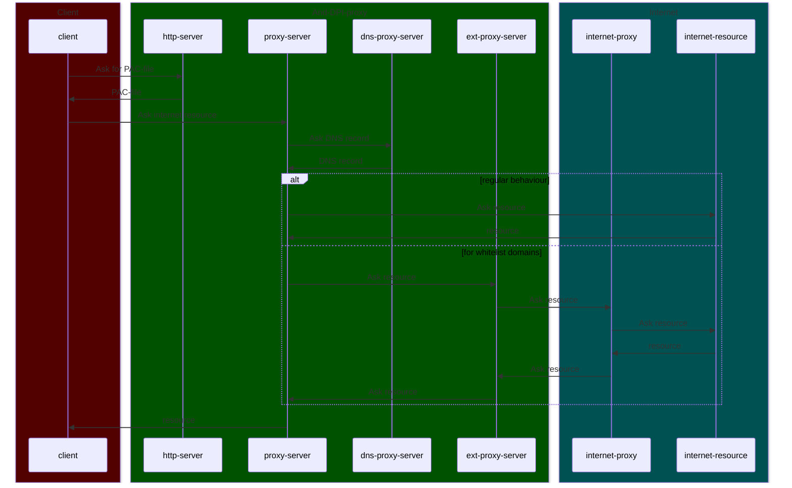

Anti DPI ([Deep packet inspection](https://en.wikipedia.org/wiki/Deep_packet_inspection)) proxy for custom domains list. Based on [Spoof DPI](https://github.com/xvzc/SpoofDPI), [Bypass DPI](https://github.com/hufrea/byedpi) and external proxies in Docker containers

The solution use [PAC](https://developer.mozilla.org/en-US/docs/Web/HTTP/Proxy_servers_and_tunneling/Proxy_Auto-Configuration_PAC_file)-file to control proxy domains, DNS-over-HTTPS and make up docker containers:
1. http-server (port 8082) for access to config(PAC) file via http-protocol (Windows [doesn't support](https://learn.microsoft.com/en-us/previous-versions/troubleshoot/browsers/administration/cannot-read-pac-file) local files)
2. dpi-socks5-proxy (port 1080) based on [Bypass DPI](https://github.com/hufrea/byedpi)-solution
3. or dpi-http-proxy (port 8888) based on [Spoof DPI](https://github.com/xvzc/SpoofDPI)-solution
4. dns-proxy (port 53) based on [DNS Proxy](https://github.com/AdguardTeam/dnsproxy)-solution
5. (optional) ext-proxy (port 3128) based on [Proxy-chain](https://github.com/apify/proxy-chain)-solution
6. (optional) ssh-proxy (port 1081) to use remove ssh-server as proxy

All servers are only accessible for the local computer!

### Benefits:
1. local solution in local sandbox (no VPN or external proxy**)
2. you can control which domains traffic has to be modified or uses via random external proxy

** external proxies can be used for specific sites, which __answers__ blocked.

### Requirements:
1. [docker compose](https://docs.docker.com/compose/) or simply [docker](https://docs.docker.com/manuals/) (native, Docker Desktop or native Docker inside [WSL2](https://learn.microsoft.com/en-us/windows/wsl/install))
2. internet

### Configuration files:
1. `domains_for_dpi_proxy.txt` - list of domains and ip masks for dpi-proxies (packets modifier)
2. `domains_for_ext_proxy.txt` - list of domains and ip masks for ext-proxies (external proxies)
3. `ext_proxies.txt` - list of external proxies, which will be uses one by one in random order
4. `ssh_proxy.conf` - configuration file to use external ssh-proxy (remote server solution you can find in ./src/ssh-proxy/remote-server/). Require setup REMOTE_HOST, REMOTE_PORT and REMOTE_USER + private/public keys in __conf/.ssh/__

### How to use it:
0. setup config files if want specific settings
1. `docker compose up`
2. setup your browser, system or application to use proxy configuration URL: __http://127.0.0.1:8082/proxy_chooser.pac__
3. (optional) setup your browser, system or application to use DNS server __127.0.0.1:53__

### Configuration hints:
- `ttl` in dpi-config has to be limited by your provider servers (`tracert/traceroute google.com`)

### If it doesn't work:
1. try to find better arguments for "Bypass DPI". Details: https://github.com/hufrea/byedpi/blob/main/readme.txt
2. try to change PROXY_COMMAND variable to "PROXY 127.0.0.1:8888" in `docker-compose.yml` and find better arguments for "Spoof DPI". Details: https://spoofdpi.xvzc.dev/user-guide/https/
3. in WSL possible require turn off [autoProxy](https://learn.microsoft.com/en-us/windows/wsl/wsl-config)

### Target solution schema

